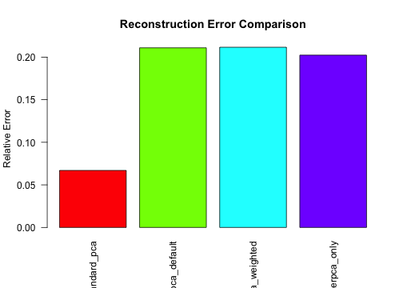

``` r
library(subpca)
library(multivarious)
library(Matrix)
library(future)
library(microbenchmark)
```

## Overview

This vignette covers advanced topics in the subpca package:

- Understanding meta-PCA concepts
- Performance optimization strategies
- Custom PCA implementations
- Handling large-scale data
- Method comparisons and selection
- Integration with other packages

## Meta-PCA: The Core Concept

The `metapca()` function is the foundation for combining multiple PCA fits:


``` r
set.seed(999)

# Create separate datasets
X1 <- matrix(rnorm(100 * 20), 100, 20)
X2 <- matrix(rnorm(100 * 30), 100, 30)
X3 <- matrix(rnorm(100 * 25), 100, 25)

# Perform individual PCAs
pca1 <- pca(X1, ncomp = 5, preproc = center())
pca2 <- pca(X2, ncomp = 5, preproc = center())
pca3 <- pca(X3, ncomp = 5, preproc = center())

# Combine with meta-PCA
fits <- list(pca1, pca2, pca3)
meta_result <- metapca(fits, ncomp = 10)

cat("Meta-PCA dimensions:\n")
#> Meta-PCA dimensions:
cat("Scores:", dim(scores(meta_result)), "\n")
#> Scores: 100 10
cat("Loadings:", dim(components(meta_result)), "\n")
#> Loadings: 75 10
```

## Meta-PCA Weighting Strategies

Different weighting strategies affect how blocks are combined:


``` r
# Equal weighting (default)
meta_equal <- metapca(fits, ncomp = 8, combine = "pca")

# Scaled by standard deviation
meta_scaled <- metapca(fits, ncomp = 8, combine = "scaled")

# MFA-style (weighted by first eigenvalue)
meta_mfa <- metapca(fits, ncomp = 8, combine = "MFA")

# Custom weights based on block importance
custom_weights <- c(1, 3, 2)  # Weight second block more
meta_weighted <- metapca(fits, ncomp = 8, weights = custom_weights)

# Compare first components
scores_equal <- scores(meta_equal)[, 1]
scores_scaled <- scores(meta_scaled)[, 1]
scores_mfa <- scores(meta_mfa)[, 1]
scores_weighted <- scores(meta_weighted)[, 1]

cor_matrix <- cor(cbind(scores_equal, scores_scaled, scores_mfa, scores_weighted))
colnames(cor_matrix) <- rownames(cor_matrix) <- 
  c("Equal", "Scaled", "MFA", "Weighted")

cat("Correlation between weighting methods:\n")
#> Correlation between weighting methods:
print(round(cor_matrix, 3))
#>          Equal Scaled   MFA Weighted
#> Equal    1.000  0.998 0.998    0.915
#> Scaled   0.998  1.000 0.999    0.906
#> MFA      0.998  0.999 1.000    0.900
#> Weighted 0.915  0.906 0.900    1.000
```

## Block-wise Projection

Project new data block by block:


``` r
# New data for each block (must match original dimensions)
X1_new <- matrix(rnorm(10 * 20), 10, 20)
X2_new <- matrix(rnorm(10 * 30), 10, 30)
X3_new <- matrix(rnorm(10 * 25), 10, 25)

# Full projection
X_new_full <- cbind(X1_new, X2_new, X3_new)
scores_full <- project(meta_result, X_new_full)

cat("Full projection dimensions:", dim(scores_full), "\n")
#> Full projection dimensions: 10 10

# Partial projection (specific columns)
# First 10 columns from block 1, columns 21-30 from block 2
col_indices <- c(1:10, 21:30)  
X_partial <- X_new_full[, col_indices]
scores_partial <- partial_project(meta_result, X_partial, colind = col_indices)
#> Error in `project.projector()`:
#> ! `ncol(new_data)` must be equal to 20L.
#> Use `rlang::last_error()$y` to show the object compared to.
cat("Partial projection dimensions:", dim(scores_partial), "\n")
#> Error: object 'scores_partial' not found

# Note: project_block function requires exact match of block structure
# which may not be available in all metapca configurations
```

## Performance Optimization

### Parallel Processing


``` r
# Set up parallel backend
plan(multisession, workers = 2)

# Large dataset for benchmarking
X_large <- matrix(rnorm(500 * 200), 500, 200)
clus_large <- rep(1:20, each = 10)

# Benchmark parallel vs sequential
bench_results <- microbenchmark(
  sequential = {
    plan(sequential)
    clusterpca(X_large, clus_large, ccomp = 2)
  },
  parallel = {
    plan(multisession, workers = 2)
    clusterpca(X_large, clus_large, ccomp = 2)
  },
  times = 3
)

print(bench_results)
#> Unit: milliseconds
#>        expr       min         lq      mean    median        uq       max neval
#>  sequential   11.9934   13.87735   14.5644   15.7613   15.8499   15.9385     3
#>    parallel 1064.9246 1389.35130 1500.8959 1713.7780 1718.8816 1723.9851     3
plan(sequential)  # Reset to sequential
```

### Memory-Efficient Sparse Representations


``` r
# Create highly structured sparse data
n_obs <- 200
n_vars <- 500
n_clusters <- 50

X_sparse_base <- matrix(0, n_obs, n_vars)
# Add signals to specific cluster regions
for(i in 1:n_clusters) {
  var_idx <- ((i-1)*10 + 1):(i*10)
  if(i %% 5 == 0) {  # Every 5th cluster has signal
    X_sparse_base[, var_idx] <- rnorm(n_obs * 10)
  }
}

clus_sparse <- rep(1:n_clusters, each = 10)

# Run clusterpca
result_sparse <- clusterpca(X_sparse_base, clus_sparse, 
                           ccomp = 1, colwise = TRUE)
#> Error:
#> ℹ In index: 1.
#> Caused by error in `svd_wrapper()`:
#> ! SVD returned zero singular values.

# Check sparsity of loadings
loadings_sparse <- coef(result_sparse)
#> Error: object 'result_sparse' not found
sparsity <- 1 - nnzero(loadings_sparse)/(nrow(loadings_sparse) * ncol(loadings_sparse))
#> Error in h(simpleError(msg, call)): error in evaluating the argument 'x' in selecting a method for function 'nnzero': object 'loadings_sparse' not found
cat("Loadings sparsity:", round(sparsity * 100, 2), "%\n")
#> Error: object 'sparsity' not found

# Memory comparison
cat("Dense matrix size:", object.size(as.matrix(loadings_sparse)), "bytes\n")
#> Error in h(simpleError(msg, call)): error in evaluating the argument 'x' in selecting a method for function 'as.matrix': object 'loadings_sparse' not found
cat("Sparse matrix size:", object.size(loadings_sparse), "bytes\n")
#> Error: object 'loadings_sparse' not found
```

## Custom PCA Implementations

Create specialized PCA functions for specific needs:


``` r
# Robust PCA using Huber loss
robust_pca <- function(X, ncomp, preproc, ind = NULL) {
  # Simple robust centering using median
  X_robust <- sweep(X, 2, apply(X, 2, median), "-")
  
  # Use MAD for scaling
  mads <- apply(X_robust, 2, mad)
  mads[mads == 0] <- 1  # Avoid division by zero
  X_robust <- sweep(X_robust, 2, mads, "/")
  
  # Standard PCA on robust-preprocessed data
  multivarious::pca(X_robust, ncomp = ncomp, preproc = pass())
}

# Sparse PCA (simplified version)
sparse_pca <- function(X, ncomp, preproc, ind = NULL) {
  X_processed <- init_transform(preproc, X)
  
  # Standard PCA first
  pca_result <- multivarious::pca(X_processed, ncomp = ncomp, preproc = pass())
  
  # Apply soft thresholding to loadings
  v <- components(pca_result)
  threshold <- 0.1 * max(abs(v))
  v[abs(v) < threshold] <- 0
  
  # Recreate bi_projector with sparse loadings
  # Note: This is simplified - real sparse PCA is more complex
  s <- X_processed %*% v
  
  bi_projector(
    v = v,
    s = s,
    sdev = apply(s, 2, sd),
    preproc = preproc,
    classes = "pca"
  )
}

# Test custom implementations
X_test <- matrix(rnorm(100 * 50), 100, 50)
X_test[1:5, ] <- X_test[1:5, ] + 10  # Add outliers
clus_test <- rep(1:5, each = 10)

result_robust <- clusterpca(X_test, clus_test, ccomp = 2, 
                           pcafun = robust_pca)
result_sparse <- clusterpca(X_test, clus_test, ccomp = 2,
                           pcafun = sparse_pca)
#> Error:
#> ℹ In index: 1.
#> Caused by error in `UseMethod()`:
#> ! no applicable method for 'init_transform' applied to an object of class "c('prepper', 'list')"

cat("Custom PCA implementations applied successfully\n")
#> Custom PCA implementations applied successfully
```

## Handling Missing Data

Strategies for dealing with missing values:


``` r
# Create data with missing values
X_missing <- matrix(rnorm(100 * 40), 100, 40)
missing_idx <- sample(length(X_missing), size = 100)
X_missing[missing_idx] <- NA

# Strategy 1: Simple imputation before analysis
X_imputed <- X_missing
for(j in 1:ncol(X_imputed)) {
  col_mean <- mean(X_imputed[, j], na.rm = TRUE)
  X_imputed[is.na(X_imputed[, j]), j] <- col_mean
}

clus <- rep(1:4, each = 10)

# Run subpca on imputed data
result_imputed <- subpca(X_imputed, clus, ncomp = 5, ccomp = 2)

cat("Analysis with imputed data completed\n")
#> Analysis with imputed data completed
cat("Result dimensions:", dim(scores(result_imputed)), "\n")
#> Result dimensions: 100 5
```

## Method Comparison Framework

Compare different approaches systematically:


``` r
# Generate structured test data
set.seed(777)
n <- 150
p <- 60

# True underlying structure
latent <- matrix(rnorm(n * 3), n, 3)  # 3 true components
loadings_true <- matrix(rnorm(p * 3), p, 3)
X_true <- latent %*% t(loadings_true)
X_observed <- X_true + matrix(rnorm(n * p, sd = 0.5), n, p)  # Add noise

# Define clusters
clus <- rep(1:6, each = 10)

# Compare methods
methods <- list(
  standard_pca = function(X) {
    pca(X, ncomp = 5, preproc = center())
  },
  subpca_default = function(X) {
    subpca(X, clus, ncomp = 5, ccomp = 2)
  },
  subpca_weighted = function(X) {
    weights <- c(2, 1, 1, 1, 1, 2)  # Weight first and last clusters
    subpca(X, clus, ncomp = 5, ccomp = 2, weights = weights)
  },
  clusterpca_only = function(X) {
    fit <- clusterpca(X, clus, ccomp = 2)
    # Create pseudo bi_projector for comparison
    list(scores = scores(fit), components = components(fit))
  }
)

# Evaluate reconstruction error for each method
reconstruction_errors <- numeric(length(methods))
names(reconstruction_errors) <- names(methods)

for(i in seq_along(methods)) {
  if(names(methods)[i] == "clusterpca_only") {
    # Special handling for clusterpca
    result <- methods[[i]](X_observed)
    X_recon <- result$scores %*% t(result$components)
  } else {
    result <- methods[[i]](X_observed)
    X_recon <- reconstruct(result, comp = 1:5)
  }
  
  reconstruction_errors[i] <- sum((X_observed - X_recon)^2) / sum(X_observed^2)
}

# Display comparison
barplot(reconstruction_errors,
        main = "Reconstruction Error Comparison",
        ylab = "Relative Error",
        col = rainbow(length(methods)),
        las = 2)
```



## Advanced Preprocessing Pipelines

Create complex preprocessing workflows:


``` r
# Custom preprocessing pipeline
library(magrittr)

# Pipeline 1: Center, scale, then whiten
preproc_whiten <- function() {
  pre_processor(
    input_dim = NA,
    output_dim = NA,
    
    transform = function(x, object) {
      x <- scale(x, center = TRUE, scale = TRUE)
      # Simple whitening
      cov_mat <- cov(x)
      eigen_decomp <- eigen(cov_mat)
      whitening_matrix <- eigen_decomp$vectors %*% 
                         diag(1/sqrt(eigen_decomp$values + 1e-8)) %*% 
                         t(eigen_decomp$vectors)
      x %*% whitening_matrix
    },
    
    inverse_transform = function(x, object) {
      # Simplified - real inverse would need stored parameters
      x
    }
  )
}

# Pipeline 2: Robust standardization
preproc_robust <- function() {
  pre_processor(
    input_dim = NA,
    output_dim = NA,
    
    transform = function(x, object) {
      # Use median and MAD instead of mean and SD
      medians <- apply(x, 2, median)
      mads <- apply(x, 2, mad)
      mads[mads == 0] <- 1
      
      sweep(sweep(x, 2, medians, "-"), 2, mads, "/")
    },
    
    inverse_transform = function(x, object) {
      x
    }
  )
}

# Note: These custom preprocessors are simplified examples
# The full implementation would need proper parameter storage
```

## Diagnostic Tools

Create diagnostic functions for model evaluation:


``` r
# Diagnostic function for subpca results
diagnose_subpca <- function(result, X_original, clus) {
  cat("=== SUBPCA DIAGNOSTIC REPORT ===\n\n")
  
  # 1. Basic info
  cat("Data dimensions:", dim(X_original), "\n")
  cat("Number of clusters:", length(unique(clus)), "\n")
  cat("Final components:", ncomp(result), "\n\n")
  
  # 2. Variance explained
  sdev_vals <- sdev(result)
  var_explained <- sdev_vals^2 / sum(sdev_vals^2)
  cumvar <- cumsum(var_explained)
  
  cat("Variance explained by component:\n")
  for(i in 1:min(5, length(var_explained))) {
    cat(sprintf("  PC%d: %.1f%% (cumulative: %.1f%%)\n", 
                i, var_explained[i]*100, cumvar[i]*100))
  }
  cat("\n")
  
  # 3. Reconstruction quality
  X_recon <- reconstruct(result)
  recon_error <- sum((X_original - X_recon)^2) / sum(X_original^2)
  cat("Reconstruction error:", round(recon_error, 4), "\n\n")
  
  # 4. Cluster contribution
  loadings <- components(result)
  cluster_contrib <- matrix(0, length(unique(clus)), ncol(loadings))
  
  for(i in unique(clus)) {
    cluster_vars <- which(clus == i)
    cluster_contrib[i, ] <- colSums(abs(loadings[cluster_vars, , drop = FALSE]))
  }
  
  cat("Cluster contributions to first 3 components:\n")
  print(round(cluster_contrib[, 1:min(3, ncol(cluster_contrib))], 3))
  cat("\n")
  
  # 5. Component orthogonality
  scores_mat <- scores(result)
  cor_mat <- cor(scores_mat)
  off_diag <- cor_mat[upper.tri(cor_mat)]
  
  cat("Component orthogonality check:\n")
  cat("  Max off-diagonal correlation:", round(max(abs(off_diag)), 4), "\n")
  cat("  Mean absolute off-diagonal:", round(mean(abs(off_diag)), 4), "\n")
  
  invisible(list(
    var_explained = var_explained,
    recon_error = recon_error,
    cluster_contrib = cluster_contrib
  ))
}

# Test the diagnostic function
X_diag <- matrix(rnorm(100 * 40), 100, 40)
clus_diag <- rep(1:4, each = 10)
result_diag <- subpca(X_diag, clus_diag, ncomp = 5, ccomp = 2)

diag_report <- diagnose_subpca(result_diag, X_diag, clus_diag)
#> === SUBPCA DIAGNOSTIC REPORT ===
#> 
#> Data dimensions: 100 40 
#> Number of clusters: 4 
#> Final components: 5 
#> 
#> Variance explained by component:
#>   PC1: 25.7% (cumulative: 25.7%)
#>   PC2: 21.8% (cumulative: 47.5%)
#>   PC3: 20.1% (cumulative: 67.5%)
#>   PC4: 17.6% (cumulative: 85.1%)
#>   PC5: 14.9% (cumulative: 100.0%)
#> 
#> Reconstruction error: 0.7994 
#> 
#> Cluster contributions to first 3 components:
#>       [,1]  [,2]  [,3]
#> [1,] 1.714 1.465 0.746
#> [2,] 1.356 1.056 1.220
#> [3,] 0.798 1.464 0.461
#> [4,] 0.956 0.998 2.237
#> 
#> Component orthogonality check:
#>   Max off-diagonal correlation: 0 
#>   Mean absolute off-diagonal: 0
```

## Integration with Other Packages

### With FactoMineR


``` r
# Example integration with FactoMineR (not run)
library(FactoMineR)

# Use subpca for initial dimension reduction
result_subpca <- subpca(X, clus, ncomp = 10, ccomp = 3)
scores_reduced <- scores(result_subpca)

# Further analysis with FactoMineR
mfa_result <- MFA(scores_reduced, 
                  group = c(3, 3, 4),  # Group the 10 components
                  type = rep("s", 3))  # All quantitative

# Visualize with FactoMineR tools
plot(mfa_result, choix = "ind")
```

### With tidymodels


``` r
# Example integration with tidymodels (not run)
library(tidymodels)
library(recipes)

# Create a recipe step for subpca
step_subpca <- function(recipe, ..., clus, ncomp = 5, ccomp = 2) {
  # Custom step implementation would go here
  # This is a conceptual example
}

# Use in a modeling workflow
rec <- recipe(outcome ~ ., data = training_data) %>%
  step_subpca(all_predictors(), 
              clus = predictor_clusters,
              ncomp = 10, 
              ccomp = 3) %>%
  step_normalize(all_predictors())
```

## Best Practices Summary

1. **Choose the right method**:
   - `subpca()`: General hierarchical PCA with known clusters
   - `clusterpca()`: When you only need cluster-level PCA
   - `hcluspca()`: When clusters should be learned from data
   - `musubpca()`: For multi-block/multi-view data

2. **Optimize performance**:
   - Use parallel processing for large datasets
   - Consider sparse representations for high-dimensional data
   - Profile code to identify bottlenecks

3. **Validate results**:
   - Check reconstruction error
   - Examine variance explained
   - Verify component orthogonality
   - Assess cluster contributions

4. **Handle edge cases**:
   - Missing data: Impute before analysis
   - Outliers: Use robust PCA variants
   - High dimensions: Consider sparse PCA

5. **Document and reproduce**:
   - Set seeds for reproducibility
   - Document preprocessing choices
   - Save diagnostic reports

## Conclusion

The subpca package provides a flexible framework for hierarchical PCA that can be adapted to various data structures and analysis needs. By understanding these advanced concepts and techniques, you can:

- Choose appropriate methods for your data
- Optimize performance for large-scale analyses
- Create custom solutions for specific requirements
- Integrate with other analytical workflows
- Diagnose and validate your results

For specific use cases, refer to the other vignettes in this package:
- `vignette("intro-subpca")`: Basic usage
- `vignette("clusterpca-vignette")`: Cluster-wise PCA
- `vignette("hcluspca-vignette")`: Hierarchical clustering PCA  
- `vignette("musubpca-vignette")`: Multi-block analysis
