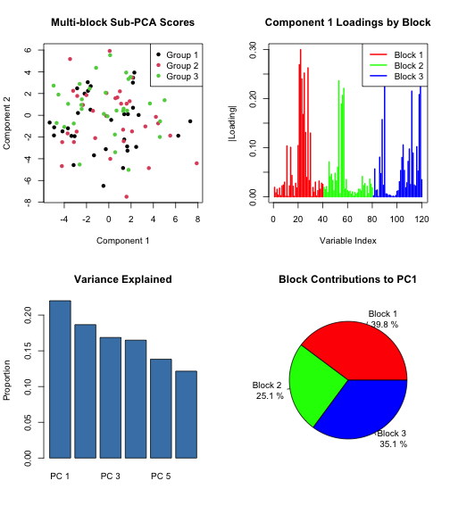

``` r
library(subpca)
#> Registered S3 method overwritten by 'future':
#>   method               from      
#>   all.equal.connection parallelly
#> 
#> Attaching package: 'subpca'
#> The following object is masked from 'package:stats':
#> 
#>     residuals
#> The following object is masked from 'package:base':
#> 
#>     truncate
library(multivarious)
#> 
#> Attaching package: 'multivarious'
#> The following objects are masked from 'package:stats':
#> 
#>     residuals, screeplot
#> The following object is masked from 'package:base':
#> 
#>     truncate
library(Matrix)
```

## Overview

The `clusterpca()` function performs separate PCA models for each cluster or block of data. Unlike `subpca()` which combines cluster-wise PCAs with a meta-PCA, `clusterpca()` focuses on the first level only, providing direct access to cluster-specific components.

## Key Features

- **Flexible clustering**: Can cluster by columns (variables) or rows (observations)
- **Variance control**: Specify fixed number of components or variance threshold
- **Custom PCA functions**: Use alternative PCA implementations
- **Sparse output**: Efficient storage using sparse matrices

## Column-wise Clustering

The most common use case is clustering variables (columns):


``` r
set.seed(42)

# Create data with 3 distinct groups of variables
n_obs <- 100
X1 <- matrix(rnorm(n_obs * 20), n_obs, 20)  # Group 1: 20 variables
X2 <- matrix(rnorm(n_obs * 30), n_obs, 30)  # Group 2: 30 variables  
X3 <- matrix(rnorm(n_obs * 25), n_obs, 25)  # Group 3: 25 variables

# Add different signals to each group
X1[, 1:5] <- X1[, 1:5] + 2 * sin(seq_len(n_obs) * pi / 25)
X2[, 1:10] <- X2[, 1:10] + 3 * cos(seq_len(n_obs) * pi / 30)
X3[, 1:8] <- X3[, 1:8] + runif(n_obs, -2, 2)

X <- cbind(X1, X2, X3)

# Define clusters
clus <- c(rep(1, 20), rep(2, 30), rep(3, 25))

# Perform cluster-wise PCA
result_col <- clusterpca(X, clus, 
                        ccomp = 3,        # 3 components per cluster
                        colwise = TRUE)   # Cluster columns
#> Warning: package 'future' was built under R version 4.3.3
#> Warning: package 'purrr' was built under R version 4.3.3

# Examine structure
str(result_col, max.level = 2)
#> List of 8
#>  $ fits         :List of 3
#>   ..$ :List of 6
#>   .. ..- attr(*, "class")= chr [1:4] "pca" "svd" "bi_projector" "projector"
#>   .. ..- attr(*, ".cache")=<environment: 0x10f40f110> 
#>   ..$ :List of 6
#>   .. ..- attr(*, "class")= chr [1:4] "pca" "svd" "bi_projector" "projector"
#>   .. ..- attr(*, ".cache")=<environment: 0x10f49b020> 
#>   ..$ :List of 6
#>   .. ..- attr(*, "class")= chr [1:4] "pca" "svd" "bi_projector" "projector"
#>   .. ..- attr(*, ".cache")=<environment: 0x10f4f2608> 
#>  $ ncomp        : int [1:3] 3 3 3
#>  $ comp_indices :List of 3
#>   ..$ : int [1:3] 1 2 3
#>   ..$ : int [1:3] 4 5 6
#>   ..$ : int [1:3] 7 8 9
#>  $ preproc      :List of 5
#>   ..$ preproc          :List of 1
#>   .. ..- attr(*, "class")= chr [1:2] "prepper" "list"
#>   ..$ init             :function (X)  
#>   ..$ transform        :function (X, colind = NULL)  
#>   ..$ reverse_transform:function (X, colind = NULL)  
#>   ..$ get_orig_ncol    :function ()  
#>   ..- attr(*, "class")= chr "pre_processor"
#>  $ groups       : num [1:3] 1 2 3
#>  $ clus         : num [1:75] 1 1 1 1 1 1 1 1 1 1 ...
#>  $ colwise      : logi TRUE
#>  $ block_indices:List of 3
#>   ..$ 1: int [1:20] 1 2 3 4 5 6 7 8 9 10 ...
#>   ..$ 2: int [1:30] 21 22 23 24 25 26 27 28 29 30 ...
#>   ..$ 3: int [1:25] 51 52 53 54 55 56 57 58 59 60 ...
#>  - attr(*, "class")= chr [1:3] "clusterpca" "bi_projector" "projector"
```

## Understanding the Output

The clusterpca object provides several methods to access results:


``` r
# Get coefficients (loadings) - sparse matrix format
loadings <- coef(result_col)
dim(loadings)
#> [1] 75  9
class(loadings)
#> [1] "dgCMatrix"
#> attr(,"package")
#> [1] "Matrix"

# Get scores
score_matrix <- scores(result_col)
dim(score_matrix)
#> [1] 100   9

# Get standard deviations
sdevs <- sdev(result_col)
length(sdevs)
#> [1] 9

# Total number of components across all clusters
total_comp <- ncomp(result_col)
cat("Total components:", total_comp, "\n")
#> Total components: 9
```

## Row-wise Clustering

You can also cluster observations (rows), useful for grouped or hierarchical data:


``` r
# Create data with grouped observations
set.seed(123)
n_vars <- 50

# Three groups of observations with different patterns
group1 <- matrix(rnorm(30 * n_vars, mean = 0), 30, n_vars)
group2 <- matrix(rnorm(40 * n_vars, mean = 2), 40, n_vars)
group3 <- matrix(rnorm(30 * n_vars, mean = -1), 30, n_vars)

X_row <- rbind(group1, group2, group3)

# Define row clusters
clus_row <- c(rep(1, 30), rep(2, 40), rep(3, 30))

# Perform row-wise clustering PCA
result_row <- clusterpca(X_row, clus_row,
                        ccomp = 2,
                        colwise = FALSE)  # Cluster rows

# Compare dimensions
cat("Row-wise scores dimensions:", dim(scores(result_row)), "\n")
#> Row-wise scores dimensions: 100 6
cat("Row-wise loadings dimensions:", dim(coef(result_row)), "\n")
#> Row-wise loadings dimensions: 50 6
```

## Variance-based Component Selection

Instead of fixing the number of components, you can specify variance explained:


``` r
# Keep components explaining 80% variance in each cluster
result_var <- clusterpca(X, clus,
                        ccomp = 0.8,      # 80% variance
                        colwise = TRUE)

# Check how many components were kept per cluster
cat("Components per cluster:\n")
#> Components per cluster:
for(i in seq_along(result_var$fits)) {
  nc <- ncomp(result_var$fits[[i]])
  cat(sprintf("Cluster %d: %d components\n", i, nc))
}
#> Cluster 1: 11 components
#> Cluster 2: 9 components
#> Cluster 3: 13 components

# Verify variance explained
for(i in seq_along(result_var$fits)) {
  fit <- result_var$fits[[i]]
  ev <- sdev(fit)^2
  cum_var <- cumsum(ev) / sum(ev)
  cat(sprintf("Cluster %d variance explained: %.1f%%\n", 
              i, cum_var[length(cum_var)] * 100))
}
#> Cluster 1 variance explained: 100.0%
#> Cluster 2 variance explained: 100.0%
#> Cluster 3 variance explained: 100.0%
```

## Variable Number of Components

You can specify different numbers of components for each cluster:


``` r
# Different components for each cluster based on their size
ccomp_vec <- c(2, 4, 3)  # 2 for cluster 1, 4 for cluster 2, 3 for cluster 3

result_varied <- clusterpca(X, clus,
                           ccomp = ccomp_vec,
                           colwise = TRUE)

# Verify the component allocation
components_per_cluster <- result_varied$ncomp
names(components_per_cluster) <- paste("Cluster", 1:3)
print(components_per_cluster)
#> Cluster 1 Cluster 2 Cluster 3 
#>         2         4         3
```

## Custom PCA Functions

You can provide custom PCA implementations:


``` r
# Create a custom PCA function that adds regularization
custom_pca_regularized <- function(X, ncomp, preproc, ind = NULL) {
  # Add small ridge to diagonal for stability
  X_centered <- scale(X, center = TRUE, scale = FALSE)
  X_reg <- X_centered + diag(0.01, nrow(X_centered), ncol(X_centered))
  
  # Use standard PCA on regularized data
  multivarious::pca(X_reg, ncomp = ncomp, preproc = pass())
}

# Apply custom PCA function
result_custom <- clusterpca(X[, 1:40], clus[1:40],
                           ccomp = 2,
                           pcafun = custom_pca_regularized,
                           colwise = TRUE)

cat("Custom PCA applied successfully\n")
#> Custom PCA applied successfully
```

## Residuals and Reconstruction

Calculate residuals after removing cluster-specific components:


``` r
# Calculate residuals using 2 components per cluster
residuals_matrix <- residuals(result_col, 
                             ncomp = 2,    # Use first 2 components per cluster
                             xorig = X)
#> Error in crossprod(x, y): requires numeric/complex matrix/vector arguments

# Reconstruction error
reconstruction_error <- sum(residuals_matrix^2) / sum(X^2)
#> Error: object 'residuals_matrix' not found
cat("Relative reconstruction error:", round(reconstruction_error, 4), "\n")
#> Error: object 'reconstruction_error' not found

# Visualize residuals for first cluster variables
cluster1_vars <- which(clus == 1)
matplot(residuals_matrix[1:20, cluster1_vars[1:5]], 
        type = "l", lty = 1,
        main = "Residuals for First 5 Variables in Cluster 1",
        xlab = "Observation", ylab = "Residual")
#> Error: object 'residuals_matrix' not found
```

## Preprocessing Options

Different preprocessing can be applied to each cluster:


``` r
# Center only
result_center <- clusterpca(X, clus,
                           ccomp = 3,
                           preproc = center(),
                           colwise = TRUE)

# Center and scale
result_scale <- clusterpca(X, clus,
                          ccomp = 3,
                          preproc = center() %>% scale(),
                          colwise = TRUE)
#> Error in colMeans(x, na.rm = TRUE): 'x' must be numeric

# Compare the results
scores_center <- scores(result_center)
scores_scale <- scores(result_scale)
#> Error: object 'result_scale' not found

# Correlation between first components
cor_comp1 <- cor(scores_center[, 1], scores_scale[, 1])
#> Error: object 'scores_scale' not found
cat("Correlation between first components:", round(cor_comp1, 3), "\n")
#> Error: object 'cor_comp1' not found
```

## Sparse Matrix Representation

For large datasets with many clusters, the sparse representation is memory-efficient:


``` r
# Create a dataset with many small clusters
set.seed(456)
n_obs <- 100
n_clusters <- 10
vars_per_cluster <- 10
n_vars_total <- n_clusters * vars_per_cluster

X_large <- matrix(rnorm(n_obs * n_vars_total), n_obs, n_vars_total)
clus_large <- rep(1:n_clusters, each = vars_per_cluster)

# Run clusterpca
result_large <- clusterpca(X_large, clus_large,
                          ccomp = 2,
                          colwise = TRUE)

# The loadings are stored as a sparse matrix
loadings_sparse <- coef(result_large)
cat("Sparse matrix dimensions:", dim(loadings_sparse), "\n")
#> Sparse matrix dimensions: 100 20
cat("Non-zero entries:", nnzero(loadings_sparse), "\n")
#> Non-zero entries: 200
cat("Sparsity:", 
    round(1 - nnzero(loadings_sparse)/(nrow(loadings_sparse) * ncol(loadings_sparse)), 4), 
    "\n")
#> Sparsity: 0.9
```

## Visualization of Cluster Structure

Visualize how different clusters contribute to the overall structure:


``` r
# Get scores and identify which components belong to which cluster
all_scores <- scores(result_col)

# Plot contributions from different clusters
par(mfrow = c(1, 3))
comp_idx <- result_col$comp_indices

for(i in 1:3) {
  cluster_scores <- all_scores[, comp_idx[[i]]]
  
  # Plot first two components from each cluster
  if(ncol(cluster_scores) >= 2) {
    plot(cluster_scores[, 1:2],
         main = paste("Cluster", i, "Components"),
         xlab = "Component 1", 
         ylab = "Component 2",
         col = i + 1)
  }
}
```



``` r
par(mfrow = c(1, 1))
```

## Performance Comparison

Compare clusterpca with standard PCA:


``` r
# Time comparison
library(microbenchmark)

# Standard PCA on all variables
time_standard <- microbenchmark(
  standard = pca(X, ncomp = 9, preproc = center()),
  times = 10
)
#> Warning in microbenchmark(standard = pca(X, ncomp = 9, preproc = center()), :
#> less accurate nanosecond times to avoid potential integer overflows

# Cluster-wise PCA
time_cluster <- microbenchmark(
  cluster = clusterpca(X, clus, ccomp = 3, preproc = center()),
  times = 10
)

# Display timings
print(time_standard)
#> Unit: milliseconds
#>      expr      min       lq     mean   median       uq      max neval
#>  standard 1.330122 1.379896 1.455955 1.443138 1.550087 1.613637    10
print(time_cluster)
#> Unit: milliseconds
#>     expr      min      lq     mean   median       uq      max neval
#>  cluster 6.056028 6.27177 6.562017 6.494708 6.941874 7.058355    10
```

## Integration with subpca

The clusterpca results can be used as building blocks for more complex analyses:


``` r
# First level: clusterpca
cluster_fit <- clusterpca(X, clus, ccomp = 3, colwise = TRUE)

# Extract cluster-wise scores for meta-analysis
cluster_scores <- scores(cluster_fit)

# You could perform additional analysis on these scores
# For example, another PCA on the concatenated scores
meta_pca <- pca(cluster_scores, ncomp = 5, preproc = center())

cat("Meta-PCA on cluster scores completed\n")
#> Meta-PCA on cluster scores completed
cat("Final dimensions:", dim(scores(meta_pca)), "\n")
#> Final dimensions: 100 5
```

## Best Practices

1. **Choose clustering carefully**: The clustering should reflect meaningful structure in your data
2. **Balance components**: Don't extract too many components from small clusters
3. **Check variance explained**: Ensure each cluster's components capture sufficient variance
4. **Consider preprocessing**: Different clusters may benefit from different preprocessing
5. **Monitor sparsity**: For many clusters, the sparse representation saves memory

## Summary

The `clusterpca()` function provides:

- Flexible cluster-wise PCA for rows or columns
- Efficient sparse matrix representation
- Multiple options for component selection
- Integration with the broader subpca ecosystem

This makes it ideal for exploring structured data where different groups of variables or observations may have distinct patterns that are best captured separately.
