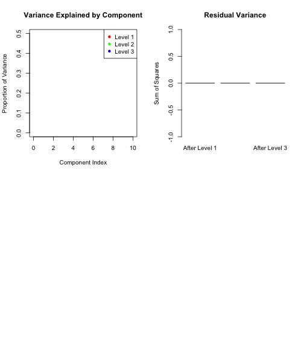

``` r
library(subpca)
library(multivarious)
library(dendextend)
#> Warning: package 'dendextend' was built under R version 4.3.3
```

## Overview

The `hcluspca()` function performs hierarchical PCA decomposition by:

1. Computing hierarchical clustering on variables
2. Cutting the dendrogram at multiple levels
3. Performing PCA within each cluster at each level
4. Optionally orthogonalizing components across levels

This creates a multi-resolution representation that captures both fine-grained and coarse-grained structure in your data.

## Basic Usage


``` r
set.seed(789)

# Create data with hierarchical structure
n_obs <- 100

# Level 1: Two main groups
group1 <- matrix(rnorm(n_obs * 30, mean = 0), n_obs, 30)
group2 <- matrix(rnorm(n_obs * 30, mean = 0), n_obs, 30)

# Level 2: Subgroups within each main group
group1[, 1:15] <- group1[, 1:15] + rnorm(n_obs, mean = 2)
group1[, 16:30] <- group1[, 16:30] + rnorm(n_obs, mean = -1)
group2[, 1:15] <- group2[, 1:15] + rnorm(n_obs, mean = 1)
group2[, 16:30] <- group2[, 16:30] + rnorm(n_obs, mean = -2)

X <- cbind(group1, group2)

# Perform hierarchical clustering PCA
result <- hcluspca(X, 
                   ncomp = 2,        # Components at first level
                   nlevels = 2,      # Number of hierarchical levels
                   ccomp = 2)        # Components per cluster at deeper levels
#> Error in hcluspca(X, ncomp = 2, nlevels = 2, ccomp = 2): unused arguments (ncomp = 2, nlevels = 2)

# The function provides informative messages about the process
```

## Understanding the Hierarchical Structure


``` r
# Examine the structure at each level
cat("Number of levels:", length(result$level_fits), "\n\n")
#> Error: object 'result' not found

for(i in seq_along(result$level_fits)) {
  level_fit <- result$level_fits[[i]]
  n_clusters <- length(unique(level_fit$clus))
  n_components <- sum(level_fit$ncomp)
  
  cat(sprintf("Level %d: %d clusters, %d total components\n", 
              i, n_clusters, n_components))
}
#> Error: object 'result' not found

# Access the dendrogram
dend <- result$hc
#> Error: object 'result' not found
plot(dend, main = "Variable Clustering Dendrogram", 
     xlab = "Variables", ylab = "Distance")
#> Error: object 'dend' not found
```

## Distance Metrics and Linkage Methods

Different distance metrics and linkage methods affect the hierarchical structure:


``` r
# Euclidean distance with complete linkage (default)
result_complete <- hcluspca(X, 
                           ncomp = 2,
                           nlevels = 2,
                           dist_method = "euclidean",
                           linkage_method = "complete")
#> Error in hcluspca(X, ncomp = 2, nlevels = 2, dist_method = "euclidean", : unused arguments (ncomp = 2, nlevels = 2, dist_method = "euclidean", linkage_method = "complete")

# Correlation-based distance with average linkage
result_correlation <- hcluspca(X,
                              ncomp = 2, 
                              nlevels = 2,
                              dist_method = "correlation",
                              linkage_method = "average")
#> Error in hcluspca(X, ncomp = 2, nlevels = 2, dist_method = "correlation", : unused arguments (ncomp = 2, nlevels = 2, dist_method = "correlation", linkage_method = "average")

# Manhattan distance with ward.D2 linkage
result_manhattan <- hcluspca(X,
                            ncomp = 2,
                            nlevels = 2,
                            dist_method = "manhattan",
                            linkage_method = "ward.D2")
#> Error in hcluspca(X, ncomp = 2, nlevels = 2, dist_method = "manhattan", : unused arguments (ncomp = 2, nlevels = 2, dist_method = "manhattan", linkage_method = "ward.D2")

# Compare clustering results
cat("Complete linkage - Level 2 clusters:", 
    length(unique(result_complete$level_fits[[2]]$clus)), "\n")
#> Error: object 'result_complete' not found
cat("Average linkage - Level 2 clusters:", 
    length(unique(result_correlation$level_fits[[2]]$clus)), "\n")
#> Error: object 'result_correlation' not found
cat("Ward linkage - Level 2 clusters:", 
    length(unique(result_manhattan$level_fits[[2]]$clus)), "\n")
#> Error: object 'result_manhattan' not found
```

## Orthogonalization

The orthogonalization option ensures components at deeper levels are orthogonal to those at higher levels:


``` r
# Without orthogonalization
result_no_ortho <- hcluspca(X,
                           ncomp = 2,
                           nlevels = 2,
                           ccomp = 2,
                           orthogonalize = FALSE)
#> Error in hcluspca(X, ncomp = 2, nlevels = 2, ccomp = 2, orthogonalize = FALSE): unused arguments (ncomp = 2, nlevels = 2)

# With orthogonalization (default)
result_ortho <- hcluspca(X,
                        ncomp = 2,
                        nlevels = 2,
                        ccomp = 2,
                        orthogonalize = TRUE)
#> Error in hcluspca(X, ncomp = 2, nlevels = 2, ccomp = 2, orthogonalize = TRUE): unused arguments (ncomp = 2, nlevels = 2)

# Compare correlation between level 1 and level 2 components
scores_no_ortho_1 <- scores(result_no_ortho$level_fits[[1]])
#> Error: object 'result_no_ortho' not found
scores_no_ortho_2 <- scores(result_no_ortho$level_fits[[2]])
#> Error: object 'result_no_ortho' not found

scores_ortho_1 <- scores(result_ortho$level_fits[[1]])
#> Error: object 'result_ortho' not found
scores_ortho_2 <- scores(result_ortho$level_fits[[2]])
#> Error: object 'result_ortho' not found

# Calculate maximum correlation
max_cor_no_ortho <- max(abs(cor(scores_no_ortho_1[, 1], scores_no_ortho_2)))
#> Error: object 'scores_no_ortho_2' not found
max_cor_ortho <- max(abs(cor(scores_ortho_1[, 1], scores_ortho_2)))
#> Error: object 'scores_ortho_2' not found

cat("Max correlation without orthogonalization:", round(max_cor_no_ortho, 4), "\n")
#> Error: object 'max_cor_no_ortho' not found
cat("Max correlation with orthogonalization:", round(max_cor_ortho, 4), "\n")
#> Error: object 'max_cor_ortho' not found
```

## Variable Number of Components

Use a function to determine components based on cluster size:


``` r
# Function to set components based on cluster size
comp_function <- function(cluster_data) {
  n_vars <- ncol(cluster_data)
  if(n_vars <= 5) return(1)
  if(n_vars <= 15) return(2)
  if(n_vars <= 30) return(3)
  return(4)
}

result_func <- hcluspca(X,
                       ncomp = comp_function,
                       nlevels = 3,
                       ccomp = comp_function)
#> Error in hcluspca(X, ncomp = comp_function, nlevels = 3, ccomp = comp_function): unused arguments (ncomp = comp_function, nlevels = 3)

# Examine component distribution
for(i in seq_along(result_func$level_fits)) {
  comps <- result_func$level_fits[[i]]$ncomp
  cat(sprintf("Level %d components per cluster: %s\n", 
              i, paste(comps, collapse = ", ")))
}
#> Error: object 'result_func' not found
```

## Multi-level Analysis

Explore patterns at different hierarchical levels:


``` r
# Create more complex hierarchical data
set.seed(456)
n_obs <- 150

# Four groups with substructure
X_complex <- matrix(rnorm(n_obs * 80), n_obs, 80)

# Add hierarchical signals
# Main division (columns 1-40 vs 41-80)
X_complex[, 1:40] <- X_complex[, 1:40] + rnorm(n_obs, mean = 1)
X_complex[, 41:80] <- X_complex[, 41:80] + rnorm(n_obs, mean = -1)

# Sub-divisions
X_complex[, 1:20] <- X_complex[, 1:20] + rnorm(n_obs, sd = 0.5)
X_complex[, 21:40] <- X_complex[, 21:40] - rnorm(n_obs, sd = 0.5)
X_complex[, 41:60] <- X_complex[, 41:60] + rnorm(n_obs, sd = 0.3)
X_complex[, 61:80] <- X_complex[, 61:80] - rnorm(n_obs, sd = 0.3)

# Three-level hierarchical PCA
result_complex <- hcluspca(X_complex,
                          ncomp = 3,
                          nlevels = 3,
                          ccomp = 2)
#> Error in hcluspca(X_complex, ncomp = 3, nlevels = 3, ccomp = 2): unused arguments (ncomp = 3, nlevels = 3)

# Visualize scores at each level
par(mfrow = c(1, 3))
for(i in 1:3) {
  level_scores <- scores(result_complex$level_fits[[i]])
  if(ncol(level_scores) >= 2) {
    plot(level_scores[, 1:2],
         main = paste("Level", i, "Scores"),
         xlab = "Component 1",
         ylab = "Component 2",
         col = rainbow(3)[i])
  }
}
#> Error: object 'result_complex' not found
par(mfrow = c(1, 1))
```

## Variance Explained Analysis

Examine how variance is distributed across levels:


``` r
# Calculate variance explained at each level
total_variance <- sum(apply(X_complex, 2, var))

for(i in seq_along(result_complex$level_fits)) {
  level_fit <- result_complex$level_fits[[i]]
  level_residuals <- result_complex$resid_mats[[i]]
  
  if(!is.null(level_residuals)) {
    residual_variance <- sum(apply(level_residuals, 2, var))
    variance_explained <- (total_variance - residual_variance) / total_variance
    
    cat(sprintf("Level %d variance explained: %.1f%%\n", 
                i, variance_explained * 100))
  }
}
#> Error: object 'result_complex' not found

# Cumulative variance explained
cumulative_var <- numeric(length(result_complex$level_fits))
#> Error: object 'result_complex' not found
for(i in seq_along(result_complex$level_fits)) {
  all_scores <- do.call(cbind, 
                       lapply(result_complex$level_fits[1:i], scores))
  recon <- all_scores %*% t(all_scores %*% t(X_complex) / nrow(X_complex))
  cumulative_var[i] <- 1 - sum((X_complex - recon)^2) / sum(X_complex^2)
}
#> Error: object 'result_complex' not found

barplot(cumulative_var * 100,
        names.arg = paste("Level", 1:length(cumulative_var)),
        main = "Cumulative Variance Explained",
        ylab = "Percentage",
        col = "steelblue")
#> Error: object 'cumulative_var' not found
```

## Custom Number of Clusters

Instead of automatic determination, specify the number of clusters per level:


``` r
# Specify exact number of clusters at each level
n_clusters <- c(2, 4, 8)  # 2 at level 1, 4 at level 2, 8 at level 3

result_fixed <- hcluspca(X_complex,
                        ncomp = 2,
                        nlevels = length(n_clusters),
                        ccomp = 2,
                        n_clusters = n_clusters)
#> Error in hcluspca(X_complex, ncomp = 2, nlevels = length(n_clusters), : unused arguments (ncomp = 2, nlevels = length(n_clusters), n_clusters = n_clusters)

# Verify cluster counts
for(i in seq_along(result_fixed$level_fits)) {
  actual_clusters <- length(unique(result_fixed$level_fits[[i]]$clus))
  cat(sprintf("Level %d: requested %d clusters, got %d clusters\n",
              i, n_clusters[i], actual_clusters))
}
#> Error: object 'result_fixed' not found
```

## SVD Methods

Choose different SVD algorithms for performance:


``` r
# Fast randomized SVD (good for large datasets)
result_fast <- hcluspca(X_complex,
                       ncomp = 2,
                       nlevels = 2,
                       svd_method = "fast")
#> Error in hcluspca(X_complex, ncomp = 2, nlevels = 2, svd_method = "fast"): unused arguments (ncomp = 2, nlevels = 2)

# Base R SVD (most stable)
result_base <- hcluspca(X_complex,
                       ncomp = 2,
                       nlevels = 2,
                       svd_method = "base")
#> Error in hcluspca(X_complex, ncomp = 2, nlevels = 2, svd_method = "base"): unused arguments (ncomp = 2, nlevels = 2)

# Compare results
scores_fast <- scores(result_fast$level_fits[[1]])
#> Error: object 'result_fast' not found
scores_base <- scores(result_base$level_fits[[1]])
#> Error: object 'result_base' not found

correlation <- cor(scores_fast[, 1], scores_base[, 1])
#> Error: object 'scores_base' not found
cat("Correlation between fast and base methods:", round(abs(correlation), 4), "\n")
#> Error: object 'correlation' not found
```

## Projection and Reconstruction

Project new data and reconstruct from components:


``` r
# Generate new test data
X_test <- matrix(rnorm(20 * 60), 20, 60)

# Get final combined representation
final_result <- result$combined_fit
#> Error: object 'result' not found

# Project test data
scores_test <- project(final_result, X_test)
#> Error: object 'final_result' not found
cat("Test scores dimensions:", dim(scores_test), "\n")
#> Error: object 'scores_test' not found

# Reconstruct training data from first 3 components
X_reconstructed <- reconstruct(final_result, comp = 1:3)
#> Error: object 'final_result' not found

# Calculate reconstruction error
recon_error <- sum((X[, 1:60] - X_reconstructed)^2) / sum(X[, 1:60]^2)
#> Error: object 'X_reconstructed' not found
cat("Reconstruction error using 3 components:", round(recon_error, 4), "\n")
#> Error: object 'recon_error' not found
```

## Visualization of Hierarchical Structure

Create a comprehensive visualization:


``` r
# Set up the plot area
par(mfrow = c(2, 2))

# 1. Dendrogram with cut levels
plot(result_complex$hc, main = "Hierarchical Clustering", 
     xlab = "", ylab = "Distance", labels = FALSE)
#> Error: object 'result_complex' not found
for(i in 1:3) {
  n_clust <- length(unique(result_complex$level_fits[[i]]$clus))
  abline(h = result_complex$cut_heights[i], col = i + 1, lty = 2)
  text(40, result_complex$cut_heights[i], 
       paste("Level", i, ":", n_clust, "clusters"),
       col = i + 1, pos = 3)
}
#> Error: object 'result_complex' not found

# 2. Scree plot for each level
var_explained_list <- list()
for(i in 1:3) {
  sdevs <- sdev(result_complex$level_fits[[i]])
  var_explained_list[[i]] <- sdevs^2 / sum(sdevs^2)
}
#> Error: object 'result_complex' not found

plot(1, type = "n", xlim = c(0, 10), ylim = c(0, 0.5),
     main = "Variance Explained by Component",
     xlab = "Component Index", ylab = "Proportion of Variance")

colors <- c("red", "green", "blue")
for(i in 1:3) {
  points(var_explained_list[[i]][1:min(10, length(var_explained_list[[i]]))], 
         col = colors[i], pch = 16, type = "b")
}
#> Error in var_explained_list[[i]]: subscript out of bounds
legend("topright", legend = paste("Level", 1:3), col = colors, pch = 16)

# 3. Scores from combined fit
combined_scores <- scores(result_complex$combined_fit)
#> Error: object 'result_complex' not found
plot(combined_scores[, 1:2],
     main = "Combined Scores (First 2 PCs)",
     xlab = "PC1", ylab = "PC2",
     col = "darkblue")
#> Error: object 'combined_scores' not found

# 4. Residual variance by level
residual_vars <- numeric(3)
for(i in 1:3) {
  if(!is.null(result_complex$resid_mats[[i]])) {
    residual_vars[i] <- sum(result_complex$resid_mats[[i]]^2)
  }
}
#> Error: object 'result_complex' not found
barplot(residual_vars,
        names.arg = paste("After Level", 1:3),
        main = "Residual Variance",
        ylab = "Sum of Squares",
        col = "coral")

par(mfrow = c(1, 1))
```



## Best Practices

1. **Choose appropriate distance metrics**: 
   - "euclidean" for absolute differences
   - "correlation" for pattern similarity
   - "manhattan" for robustness to outliers

2. **Select linkage carefully**:
   - "complete" for well-separated clusters
   - "average" for balanced clustering
   - "ward.D2" for minimizing within-cluster variance

3. **Balance hierarchy depth**: More levels provide finer resolution but increase complexity

4. **Use orthogonalization**: When you want truly hierarchical decomposition

5. **Monitor variance explained**: Ensure each level contributes meaningfully

## Summary

The `hcluspca()` function provides:

- Multi-resolution analysis through hierarchical decomposition
- Flexible clustering and component selection
- Optional orthogonalization for true hierarchy
- Integration with standard PCA workflow

This makes it ideal for exploring data with natural hierarchical structure or when you want to understand patterns at multiple scales simultaneously.
