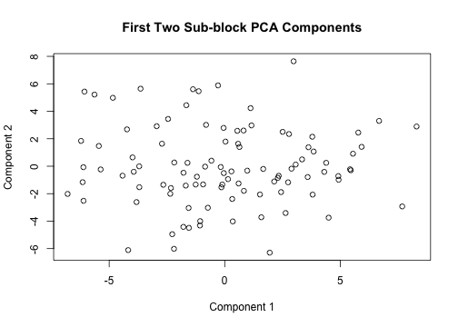
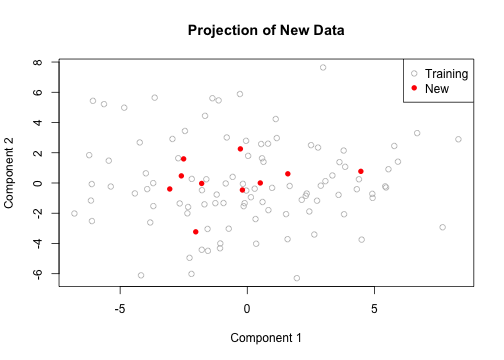
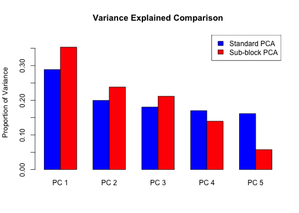

``` r
library(subpca)
#> Registered S3 method overwritten by 'future':
#>   method               from      
#>   all.equal.connection parallelly
#> 
#> Attaching package: 'subpca'
#> The following object is masked from 'package:stats':
#> 
#>     residuals
#> The following object is masked from 'package:base':
#> 
#>     truncate
library(multivarious)
#> 
#> Attaching package: 'multivarious'
#> The following objects are masked from 'package:stats':
#> 
#>     residuals, screeplot
#> The following object is masked from 'package:base':
#> 
#>     truncate
```

## Overview

The `subpca` package provides methods for performing principal component analysis (PCA) on sub-blocks or clusters of data, followed by a second-level "meta-PCA" that combines the cluster-wise results. This hierarchical approach is useful when:

- Your data naturally divides into meaningful groups or clusters
- You want to capture both within-cluster and between-cluster variation
- You need to reduce dimensionality while preserving cluster structure
- You're working with multi-block or multi-view data

## Basic Concepts

### Traditional PCA vs Sub-block PCA

Traditional PCA finds orthogonal components that maximize variance across all variables simultaneously. Sub-block PCA:

1. First performs PCA within each cluster/block of variables
2. Then performs a meta-PCA on the concatenated cluster-wise scores
3. Combines both levels to create final components

This two-level approach can better preserve local structure within clusters while still capturing global patterns.

## Quick Start with subpca()

Let's start with a simple example using simulated data:


``` r
set.seed(123)

# Create data with 100 observations and 50 variables
n_obs <- 100
n_vars <- 50

# Generate data with cluster structure
# Variables 1-25 from one process, 26-50 from another
X1 <- matrix(rnorm(n_obs * 25, mean = 0, sd = 1), n_obs, 25)
X2 <- matrix(rnorm(n_obs * 25, mean = 0, sd = 2), n_obs, 25)
X <- cbind(X1, X2)

# Add some signal
X[, 1:5] <- X[, 1:5] + rnorm(n_obs, mean = 3)
X[, 26:30] <- X[, 26:30] + rnorm(n_obs, mean = -2)

# Define clusters (2 clusters of 25 variables each)
clus <- rep(1:2, each = 25)

# Perform sub-block PCA
result <- subpca(X, clus, 
                 ncomp = 5,      # Final number of components
                 ccomp = 3)      # Components per cluster
#> Warning: package 'future' was built under R version 4.3.3
#> Warning: package 'purrr' was built under R version 4.3.3
#> Registered S3 method overwritten by 'genpca':
#>   method                   from        
#>   transfer.cross_projector multivarious

# View the results
print(result)
#> subpca:  subpca metapca pca bi_projector projector 
#> number of clusters:  2 
#> input dim:  50 
#> output dim:  5
```

## Understanding the Results

The `subpca` object contains:


``` r
# Get component scores (observations × components)
scores_matrix <- scores(result)
dim(scores_matrix)
#> [1] 100   5

# Get component loadings (variables × components)
loadings_matrix <- components(result)
dim(loadings_matrix)
#> [1] 50  5

# Visualize the first two components
plot(scores_matrix[, 1:2], 
     main = "First Two Sub-block PCA Components",
     xlab = "Component 1", 
     ylab = "Component 2")
```



## Controlling Component Extraction

You can control how many components are extracted at each level:


``` r
# Extract different numbers of components per cluster
result_varied <- subpca(X, clus,
                       ncomp = 4,           # Final components
                       ccomp = c(2, 3))     # 2 from cluster 1, 3 from cluster 2

# Use variance explained criterion (80% per cluster)
result_variance <- subpca(X, clus,
                         ncomp = 5,
                         ccomp = 0.8)        # Keep 80% variance per cluster
```

## Preprocessing Options

The package integrates with `multivarious` for flexible preprocessing:


``` r
# Center and scale the data
result_scaled <- subpca(X, clus,
                       ncomp = 5,
                       ccomp = 3,
                       preproc = center() %>% scale())
#> Error in colMeans(x, na.rm = TRUE): 'x' must be numeric

# Just center without scaling
result_centered <- subpca(X, clus,
                         ncomp = 5,
                         ccomp = 3,
                         preproc = center())
```

## Weighting Clusters

You can assign different weights to clusters to control their influence:


``` r
# Give more weight to the second cluster
weights <- c(1, 2)  # Cluster 2 gets twice the weight

result_weighted <- subpca(X, clus,
                         ncomp = 5,
                         ccomp = 3,
                         weights = weights)

# Compare weighted vs unweighted
scores_unweighted <- scores(result)
scores_weighted <- scores(result_weighted)

# The weighted version emphasizes patterns from cluster 2
cor(scores_unweighted[, 1], scores_weighted[, 1])
#> [1] 0.9992454
```

## Projection of New Data

You can project new observations onto the learned components:


``` r
# Generate new test data with same structure
X_new <- cbind(
  matrix(rnorm(10 * 25, mean = 0, sd = 1), 10, 25),
  matrix(rnorm(10 * 25, mean = 0, sd = 2), 10, 25)
)

# Project onto the subpca space
scores_new <- project(result, X_new)
dim(scores_new)
#> [1] 10  5

# Visualize new points with training data
plot(scores_matrix[, 1:2], col = "gray", 
     main = "Projection of New Data",
     xlab = "Component 1", ylab = "Component 2")
points(scores_new[, 1:2], col = "red", pch = 16)
legend("topright", legend = c("Training", "New"), 
       col = c("gray", "red"), pch = c(1, 16))
```



## Reconstruction

You can reconstruct the original data from a subset of components:


``` r
# Reconstruct using first 3 components
X_reconstructed <- reconstruct(result, comp = 1:3)

# Calculate reconstruction error
reconstruction_error <- sum((X - X_reconstructed)^2) / sum(X^2)
cat("Relative reconstruction error:", round(reconstruction_error, 4), "\n")
#> Relative reconstruction error: 0.8655

# Reconstruct for specific observations and variables
X_partial <- reconstruct(result, 
                        comp = 1:2,
                        rowind = 1:5,      # First 5 observations
                        colind = 1:10)     # First 10 variables
dim(X_partial)
#> [1]  5 10
```

## Comparison with Standard PCA

Let's compare sub-block PCA with standard PCA:


``` r
# Standard PCA
pca_standard <- pca(X, ncomp = 5, preproc = center())

# Sub-block PCA
pca_subblock <- subpca(X, clus, ncomp = 5, ccomp = 3, preproc = center())

# Compare variance explained
var_standard <- sdev(pca_standard)^2 / sum(sdev(pca_standard)^2)
var_subblock <- sdev(pca_subblock)^2 / sum(sdev(pca_subblock)^2)

# Create comparison plot
barplot(rbind(var_standard[1:5], var_subblock[1:5]),
        beside = TRUE,
        names.arg = paste("PC", 1:5),
        col = c("blue", "red"),
        main = "Variance Explained Comparison",
        ylab = "Proportion of Variance",
        ylim = c(0, max(c(var_standard, var_subblock)) * 1.1))
legend("topright", legend = c("Standard PCA", "Sub-block PCA"),
       fill = c("blue", "red"))
```



## Next Steps

This vignette covered the basics of using `subpca()`. For more advanced topics, see:

- `vignette("clusterpca-vignette")` - Detailed guide to cluster-wise PCA
- `vignette("hcluspca-vignette")` - Hierarchical clustering PCA
- `vignette("musubpca-vignette")` - Multi-block sub-PCA
- `vignette("advanced-vignette")` - Advanced topics and meta-PCA

## Summary

The `subpca` package provides a flexible framework for hierarchical PCA that:

- Preserves cluster structure while reducing dimensionality
- Allows fine control over component extraction at each level
- Supports various preprocessing and weighting options
- Integrates seamlessly with the `multivarious` package ecosystem

This makes it particularly useful for analyzing structured data where variables naturally group into meaningful clusters or blocks.
